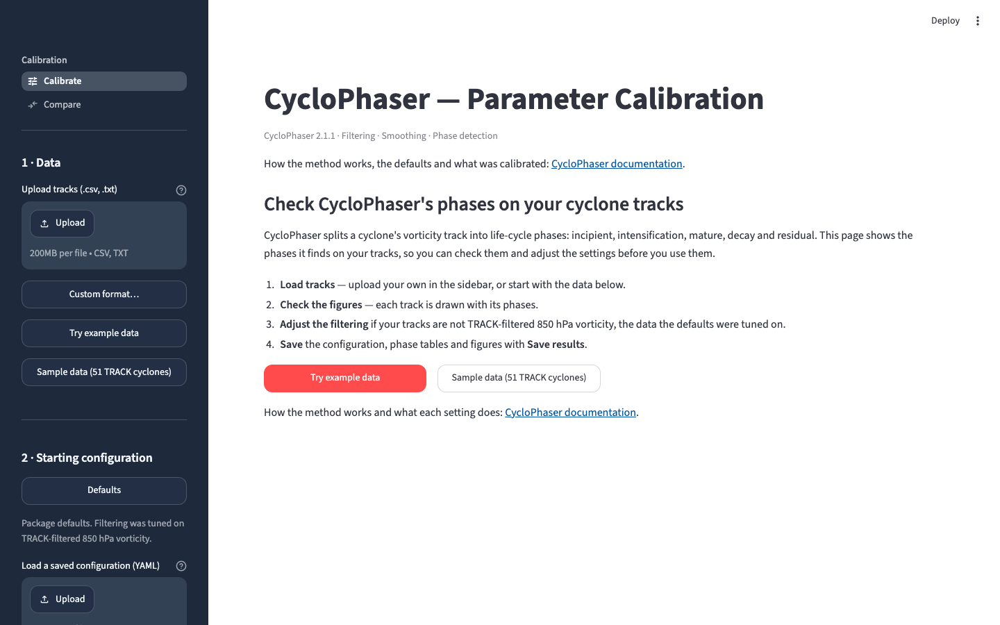
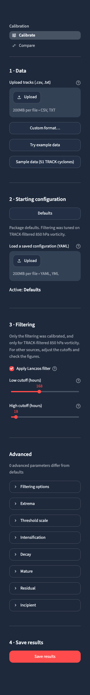
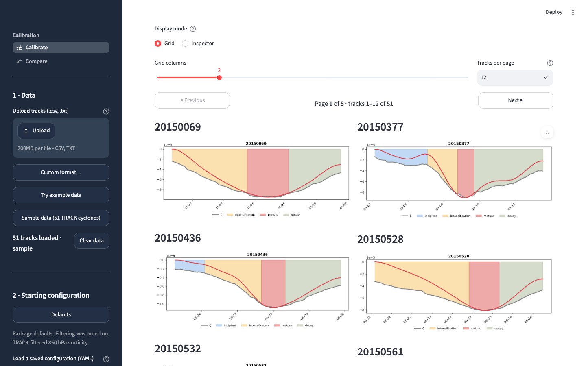
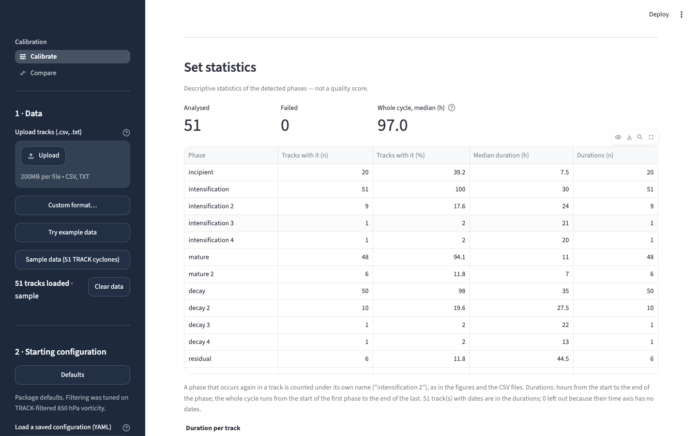
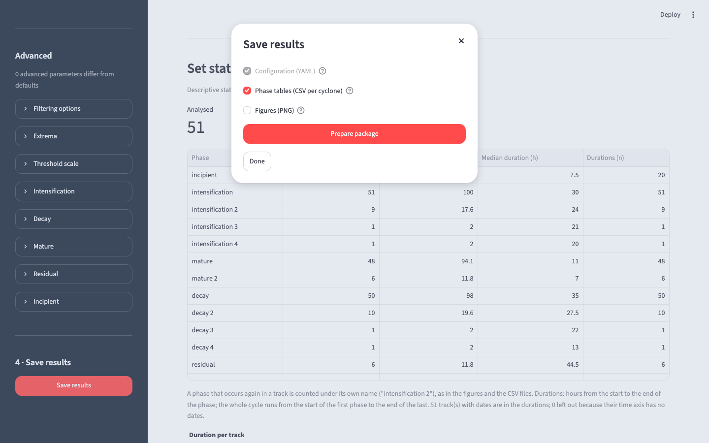

.. _calibration_tool:

Calibration app
===============

The calibration app runs CycloPhaser on your own tracks, in the browser, and
shows how each filtering and phase-detection parameter changes the result.

**Hosted version:** https://cyclophaser.streamlit.app

What it is for
--------------

* Check the phases CycloPhaser finds on a set of tracks, and adjust the
  filtering when the tracks are not the data the defaults were tuned on.
* Inspect one track in detail: the filtered series, the peaks and valleys, and
  what each detection rule decided.
* Compare configurations side by side on the same tracks (the **Compare**
  page).
* **Save** the configuration as a YAML file, with the phase tables and figures
  if wanted, and load the configuration back later.

Pages
-----

The menu at the top of the sidebar has two pages:

* **Calibrate** — load tracks, check the detected phases, adjust the
  parameters and save the results. Described below.
* **Compare** — run configurations side by side on the tracks loaded in
  Calibrate, and see what changes. Described below.

The app also has pages and functions for the developers who calibrate the
package (manual labelling of tracks, validating configurations against those
labels, the synthetic test cases, marking a detection as bad). They are not
part of the hosted app: they exist only when the app is started with a
developer key, described in the app's README.

Calibrate
---------

When nothing is loaded, the page explains what it does and shows the four
steps, with buttons to start from the example track or from the sample tracks.
No detection runs until tracks are loaded.

   The Calibrate page as opened.

The sidebar follows the work in steps:

1. **Data** — upload tracks (``.csv`` or ``.txt``; files in another layout are
   read through **Custom format…**), or load the example track or the 51 sample
   tracks bundled with the repository.
2. **Starting configuration** — the package defaults, or a configuration saved
   earlier (YAML). A line tells which one is active, and whether it has been
   edited since.
3. **Filtering** — the Lanczos filter and its two cutoffs: the only part of the
   defaults that was calibrated, and only for TRACK-filtered 850 hPa relative
   vorticity. For tracks of another kind, adjust the cutoffs and check the
   figures.
4. **Save results** — see below.

Under **Advanced**, every other parameter, grouped in the order the detector
applies them (filtering options, extrema, threshold scale, intensification,
decay, mature, residual, incipient). A line counts how many of them differ from
the defaults, and can list them.

   The Calibrate sidebar.

Grid and Inspector
^^^^^^^^^^^^^^^^^^

**Grid** draws one phase figure per track. The grid is paged — 12, 24 or 48
tracks per page — and only the figures of the page on screen are drawn, so a
change of parameter stays quick with many tracks. Detection still runs on every
loaded track: the table below the grid and the statistics cover all of them.

   The Grid, with the 51 sample tracks loaded.

**Inspector** shows one track with every series of the pipeline and every
decision of the detector on its own layer, switchable one by one.

Set statistics
^^^^^^^^^^^^^^

At the end of the Grid, descriptive statistics of the phases detected on all
loaded tracks: how many tracks were analysed and how many failed, the share of
tracks with each phase, the duration of each phase and of the whole cycle (in
hours), and the most common phase sequences. A phase that occurs again in a
track is counted under its own name ("intensification 2"), as in the figures and
in the saved phase tables. These numbers describe what was detected; they are
not a quality score.

   The set statistics of the 51 sample tracks.

Save results
^^^^^^^^^^^^

**Save results**, at the end of the sidebar, builds one ZIP file:

* ``parameters.yaml`` — the configuration, always included;
* ``<track>_periods.csv`` — the start and end of every phase, one file per
  track (included by default);
* ``<track>_periods.png`` — the phase figure of every track (optional; takes a
  while with many tracks).

   The Save results dialog.

Compare
-------

**Compare** answers one question: what changes in the phases of your tracks when
the configuration changes? It runs on the tracks loaded in Calibrate (it has no
upload of its own) and compares up to four configurations, each a column:
**Current settings** (the Calibrate sidebar when the column is added),
**Defaults**, or a configuration saved earlier (**Upload YAML**). Each column
can be edited or removed on the page.

Nothing runs until **Run** is pressed; while Run is not possible, a line says
why. Results are kept per configuration and track, so a second Run after one
change recomputes only what changed.

The results are measured against a **reference** column of your choice: for
each other configuration, how many tracks changed their phase sequence, how far
the phase boundaries moved (on the tracks whose sequence did not change), and
which phases appeared or disappeared. Then the phase figures of every track,
side by side or stacked, with an option to show only the tracks whose sequence
differs from the reference. These numbers are differences between
configurations, not a quality score.

Using a saved configuration in a script
---------------------------------------

``parameters.yaml`` has two sections, ``filter_params`` and ``phase_params``.
Pass them to ``determine_periods`` to run the same configuration in a script:

.. code-block:: python

   import yaml
   from cyclophaser import determine_periods

   with open("parameters.yaml") as f:
       config = yaml.safe_load(f)

   result = determine_periods(series, **config["filter_params"], **config["phase_params"])

A check that is switched off in the app (the prominence filter, the decay-tail
extension) is written to the file as ``null``, which is how the package reads
"off". The same file can be loaded back in step 2 of the app.

Your data
---------

The hosted version holds uploaded files in memory for the session only, but the
files do leave your computer. For unpublished or sensitive data, run the app
locally.

Run it locally
--------------

From a clone of the repository:

.. code-block:: bash

   git clone https://github.com/daniloceano/CycloPhaser.git
   cd CycloPhaser/tools/calibration_app
   pip install -r requirements-app.txt
   cd ../..
   streamlit run tools/calibration_app/app.py

``requirements-app.txt`` installs CycloPhaser from the clone, in editable mode
(its ``-e ../..`` line is why it is installed from ``tools/calibration_app``).
The app opens at http://localhost:8501. Starting it from the repository root
applies the same theme as the hosted version.

The app's own documentation (input formats, the developer key, the Compare
page and the developer pages) is in :repo:`tools/calibration_app/README.md`. The screenshots on this
page are made by ``docs/figures/make_app_screenshots.py``.
