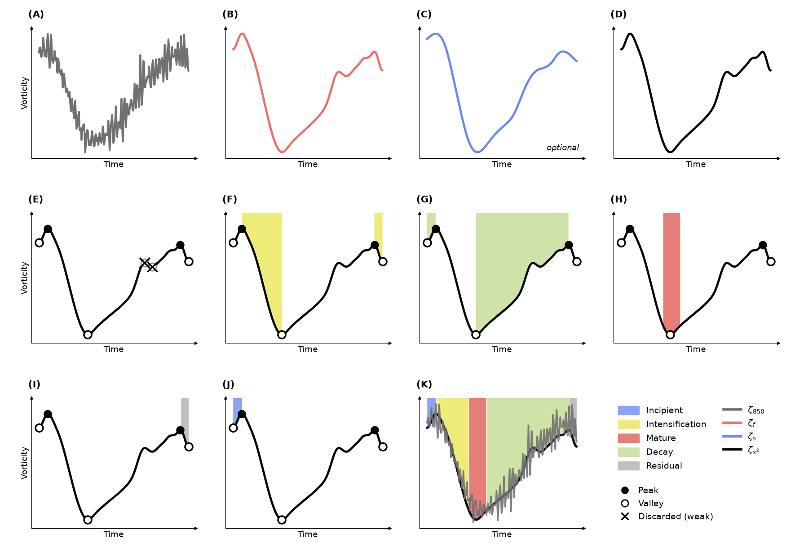

.. CycloPhaser documentation master file

CycloPhaser
===========

CycloPhaser splits the life cycle of an extratropical cyclone into phases:
**incipient**, **intensification**, **mature**, **decay** and **residual**. It
reads one number per time step, the relative vorticity at the cyclone's centre,
and returns the phase of every time step.

What it needs
-------------

A time series of relative vorticity **along a cyclone track**: one value per time
step, taken at the cyclone's centre as it moves. The package was built and
calibrated on 850 hPa relative vorticity along Southern-Hemisphere tracks, where
a deeper cyclone has a more negative vorticity.

CycloPhaser does **not** track cyclones. The series has to come from a tracking
algorithm; Walker et al. (2020) review the approaches. Open-source tracking
tools, such as `CyTRACK <https://github.com/apalarcon/CyTRACK>`_
(Pérez-Alarcón et al., 2024), and cyclone track databases, such as the
`Atlantic extratropical cyclone tracks database <https://data.mendeley.com/datasets/kwcvfr52hp/4>`_
(Gramcianinov et al., 2020), are publicly available.

Try it without installing
-------------------------

The calibration app runs CycloPhaser on your own tracks in the browser:
https://cyclophaser.streamlit.app (see :doc:`calibration_tool`).

How to cite
-----------

If you use CycloPhaser, please cite:

    de Souza, D. C., da Silva Dias, P. L., Gramcianinov, C. B., & de Camargo, R. (2025). CycloPhaser: A Python Package for Detecting Extratropical Cyclone Life Cycles. Journal of Open Source Software, 10(108), 7363. https://doi.org/10.21105/joss.07363

The method was first used in de Souza et al. (2024).

Contents
--------

.. toctree::
   :maxdepth: 2

   installation
   usage
   overview
   defaults
   calibration_tool
   api
   testing
   contribute
   license
   Changelog <https://github.com/daniloceano/CycloPhaser/blob/master/CHANGELOG.md>

References
----------

- de Souza, D. C., da Silva Dias, P. L., Gramcianinov, C. B., & de Camargo, R. (2025). CycloPhaser: A Python Package for Detecting Extratropical Cyclone Life Cycles. Journal of Open Source Software, 10(108), 7363. https://doi.org/10.21105/joss.07363

- de Souza, D. C., da Silva Dias, P. L., Gramcianinov, C. B., da Silva, M. B. L., & de Camargo, R. (2024). New perspectives on South Atlantic storm track through an automatic method for detecting extratropical cyclones' lifecycle. *International Journal of Climatology*, 44(10), 3568-3588.

- Gramcianinov, C. B., Campos, R. M., de Camargo, R., Hodges, K. I., Guedes Soares, C., & da Silva Dias, P. L. (2020). Atlantic extratropical cyclone tracks in 41 years of ERA5 and CFSR/CFSv2 databases. *Mendeley Data*, 4, 108111.

- Pérez-Alarcón, A., Coll-Hidalgo, P., Trigo, R. M., Nieto, R., & Gimeno, L. (2024). CyTRACK: An open-source and user-friendly Python toolbox for detecting and tracking cyclones. *Environmental Modelling & Software*, 176, 106027.

- Walker, E., Mitchell, D. M., & Seviour, W. J. (2020). The numerous approaches to tracking extratropical cyclones and the challenges they present. *Weather*, 75(11), 336-341.
