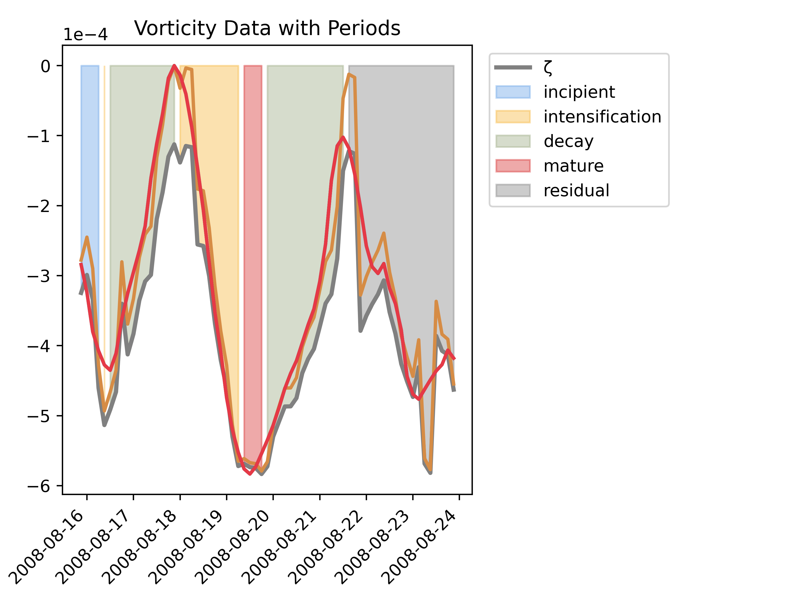

.. CycloPhaser documentation master file

Welcome to CycloPhaser's Documentation!
========================================

CycloPhaser is a Python-based tool for analyzing extratropical cyclone life cycle phases.

Contents:

.. toctree::
   :maxdepth: 2

   overview
   statement_of_need
   installation
   usage
   testing
   api
   contribute
   license

Indices and Tables
==================

* :ref:`genindex`
* :ref:`modindex`
* :ref:`search`

