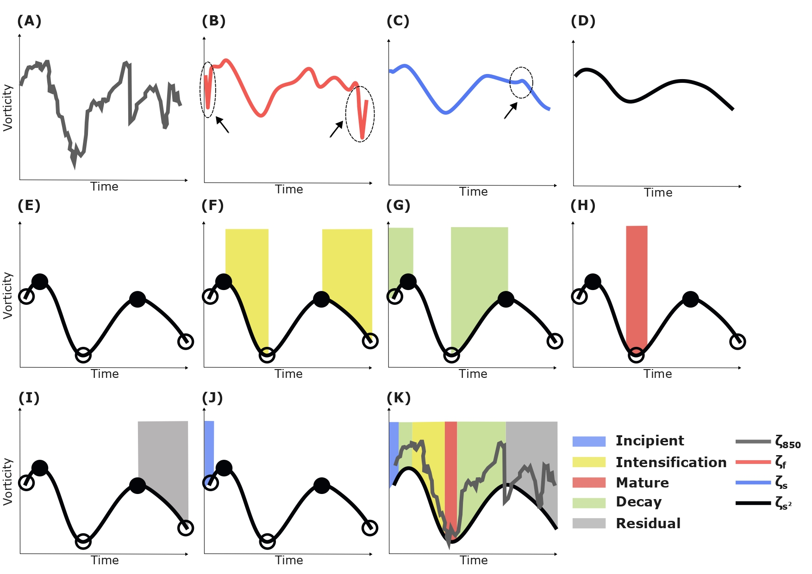

Procedure Overview
==================

The **CycloPhaser** program identifies distinct phases of cyclone life cycles by analyzing the relative vorticity time series at the cyclone center and its first derivative. This method enables precise detection of four main stages: **incipient**, **intensification**, **mature**, and **decay**. 

   **Figure**: **Illustration of CycloPhaser Methodology**: (A) Raw vorticity time series showing the initial data used for phase detection. (B) Smoothed vorticity after applying the Lanczos filter to remove high-frequency noise. The dashed circles highlight spurious oscillations due to the discontinuities at the endpoints. (C) Series after the use of Savitzky-Golay filter for the smoothing process, which is applied twice (D). (E) Peaks and valleys of the smoothed vorticity series. (F) Detection of the intensification stage (highlighted in yellow).(G) Detection of the decay stages (highlighted in green). (H) Detection of the mature stage (highlighted in red). (I) Detection of the residual stage (highlighted in gray). (J) The incipient stage (highlighted in blue) is the final phase to be detected, representing the early development of the cyclone. (K) Full cyclone life cycle phases. Figure from de Souza et al. (2024).

1. **Preprocessing and Filtering**: The program begins by applying optional preprocessing:

   - Firstly, the **Lanczos filter** is used to remove noise from the vorticity series. As a spectral filter, discontinuities at the endpoints can generate spurious oscillations, which are removed.
  
   - Following this, the **Savitzky-Golay filter** is applied to smooth the data, ensuring a sinusoidal pattern in the vorticity series and its derivative, thus avoiding the appearance of high-frequency noise in the derivative series.
  
2. **Phase Detection**: The program automatically identifies peaks and valleys in the smoothed vorticity data, which are used to detect key life cycle phases. These phases include:

   - **Incipient Stage**: Detected from unassigned periods at the beginning of the cyclone life cycle (although it is the first cyclone phase, it is the last to be detected).
   
   - **Intensification Stage**: Marked by an increase in vorticity intensity (more negative in the Southern Hemisphere) from one peak to a subsequent valley along the vorticity series.
   
   - **Mature Stage**: Identified as the interval between a derivative valley and its following derivative peak, representing the cyclone’s peak strength (minimum central vorticity in the Southern Hemisphere).
   
   - **Decay Stage**: Detected as the decrease in vorticity after the mature phase until the system dissipates.

3. **Residual Stage**: This stage accounts for systems that re-intensify without progressing to maturity.

Although the program is calibrated for the Southern Hemisphere, users can apply it to Northern Hemisphere vorticity series by multiplying the values by -1. The program is fully customizable for use with different datasets, allowing users to adjust parameters such as the window length for Lanczos filtering or Savitzky-Golay smoothing.

For more detailed information, you can refer to the original publication: de Souza et al. (2024). *New perspectives on South Atlantic storm track through an automatic method for detecting extratropical cyclones' lifecycle*. International Journal of Climatology.