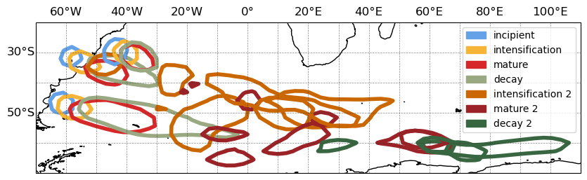

Statement of Need
=================

Extratropical cyclones are key features of the climate system. In South America, they are especially important due to the presence of cyclogenesis hotspots in southeast Brazil (SE-BR), the La Plata River basin (LA-PLATA), and southeastern Argentina (ARG) [1]_ [2]_. These cyclones can cause extreme precipitation, intense winds, high sea waves, and landslides, significantly impacting communities [3]_ [4]_ [5]_ [6]_. Understanding their temporal and spatial development and evolution is crucial for improving forecasts, ultimately aiding in the adoption of mitigation and adaptation strategies.

Accurately identifying the regions where cyclones are positioned throughout their distinct life cycle stages remains a significant challenge in atmospheric sciences. Seminal works by Bjerknes and Solberg [7]_, Shapiro and Keyser [8]_, and Neiman and Shapiro [9]_ described extratropical cyclone life cycles in terms of structural changes and large-scale dynamics. However, these classifications were based on manual analysis of satellite imagery and synoptic charts, limiting their applicability to large datasets with multiple cyclone cases. 

Recent research has sought to objectively define cyclone life cycle stages using techniques such as normalizing the life cycle duration [10]_ [11]_ or bisecting the cycle into "intensification" and "decay" phases by focusing on periods before and after peak vorticity or the lowest central pressure [12]_ [13]_ [14]_ [15]_ [16]_. While these approaches support the study of cyclone intensification and decay, they tend to overlook critical phases such as the incipient stage — where environmental dynamics are still adapting to the developing low-level disturbance and surface isobars are not yet fully closed. Additionally, they treat the mature phase as a single time step, failing to account for the possibility that it may encompass multiple time steps during which the cyclone exhibits homogeneous features.

The pioneering work by Couto de Souza et al. [17]_ was the first to offer a comprehensive analysis of extratropical cyclone life cycles, dissecting systems into distinct life cycle phases and enabling the detection of multiple configurations across different systems. This study presents the Python package that facilitated such work. The method allows for an automated classification of cyclone life cycle stages, enabling the efficient processing of large datasets with minimal computational cost. This tool opens new avenues for research, such as analyzing cyclone life cycle behavior in climate change projections, enabling comparisons with present-day climates, and providing insights into how cyclone life cycles may evolve in response to climate variability. Additionally, it offers potential for assisting model validation by comparing the spatial positioning of life cycle phases across different models and reanalysis datasets. The package is both flexible and fully customizable, making it adaptable to a wide range of datasets and research needs.

   Yearly cyclone track densities normalized for the three cyclogenesis regions along the South American coast (SE-BR, LA-PLATA, and ARG). Contours represent normalized track densities above 0.8, plotted individually for each region. Details regarding the genesis regions, tracking procedures, and analysis techniques are discussed in Couto de Souza et al. [17]_.

.. rubric:: References

.. [1] Gramcianinov, C. B. et al. (2019). The properties and genesis environments of South Atlantic cyclones. *Climate Dynamics*, 53, 4115-4140. DOI: https://doi.org/10.1007/s00382-019-04778-1
.. [2] Cardoso, A. A. et al. (2022). Synoptic Climatology of Subtropical Cyclone Impacts on Near-Surface Winds Over the South Atlantic Basin. *Earth and Space Science*, 9(11). DOI: https://doi.org/10.1029/2022ea002482
.. [3] De Souza, D. C. et al. (2021). Ocean-Land Atmosphere Model (OLAM) performance for major extreme meteorological events near the coastal region of southern Brazil. *Climate Research*, 84, 1-21. DOI: 10.3354/cr01651
.. [4] De Souza, D. C. et al. (2024). Extreme rainfall and landslides as a response to human-induced climate change: a case study at Baixada Santista, Brazil, 2020. *Natural Hazards*. DOI: https://doi.org/10.1007/s11069-024-06621-1
.. [5] Cardoso, A. A. et al. (2022). Synoptic Climatology of Subtropical Cyclone Impacts on Near-Surface Winds Over the South Atlantic Basin. *Earth and Space Science*, 9(11), e2022EA002482. DOI: https://doi.org/10.1029/2022ea002482
.. [6] Gramcianinov, C. B. et al. (2023). Impact of extratropical cyclone intensity and speed on the extreme wave trends in the Atlantic Ocean. *Climate Dynamics*, 60, 1447-1466. DOI: https://doi.org/10.21203/rs.3.rs-995499/v1
.. [7] Bjerknes, J. and Solberg, H. (1922). *Life Cycle of Cyclones and the Polar Front Theory of Atmospheric Circulation*. Grondahl. DOI: 10.1175/1520-0493(1922)50<468:JBAHSO>2.0.CO;2
.. [8] Shapiro, M. A. and Keyser, D. (1990). *Fronts, Jet Streams and the Tropopause*. Springer. DOI: https://doi.org/10.1007/978-1-944970-33-8_10
.. [9] Neiman, P. J. and Shapiro, M. A. (1993). The Life Cycle of an Extratropical Marine Cyclone. Part I: Frontal-Cyclone Evolution and Thermodynamic Air-Sea Interaction. *Monthly Weather Review*, 121(8), 2153-2176. DOI: https://doi.org/10.1175/1520-0493(1993)121<2153:TLCOAE>2.0.CO;2
.. [10] Schemm, S., Sprenger, M., and Wernli, H. (2018). When during Their Life Cycle Are Extratropical Cyclones Attended by Fronts? *Bulletin of the American Meteorological Society*, 99(1), 149-165. DOI: https://doi.org/10.1175/bams-d-16-0261.1
.. [11] Rudeva, I. and Gulev, S. K. (2007). Climatology of Cyclone Size Characteristics and Their Changes during the Cyclone Life Cycle. *Monthly Weather Review*, 135(7), 2568-2587. DOI: https://doi.org/10.1175/mwr3420.1
.. [12] Dacre, H. F. and Gray, S. L. (2009). The Spatial Distribution and Evolution Characteristics of North Atlantic Cyclones. *Monthly Weather Review*, 137(1), 99-115. DOI: https://doi.org/10.1175/2008mwr2491.1
.. [13] Trigo, I. F. (2006). Climatology and interannual variability of storm-tracks in the Euro-Atlantic sector: a comparison between ERA-40 and NCEP/NCAR reanalyses. *Climate Dynamics*, 26(2), 127-143. DOI: https://doi.org/10.1007/s00382-005-0065-9
.. [14] Azad, R. and Sorteberg, A. (2014). The Vorticity Budgets of North Atlantic Winter Extratropical Cyclone Life Cycles in MERRA Reanalysis. Part I: Development Phase. *Journal of the Atmospheric Sciences*, 71(9), 3109-3128. DOI: https://doi.org/10.1175/jas-d-13-0267.1
.. [15] Booth, J. F. et al. (2018). Extratropical Cyclone Precipitation Life Cycles: A Satellite-Based Analysis. *Geophysical Research Letters*, 45(16), 8647-8654. DOI: https://doi.org/10.1029/2018gl078977
.. [16] Michaelis, A. C. et al. (2017). Changes in Winter North Atlantic Extratropical Cyclones in High-Resolution Regional Pseudo–Global Warming Simulations. *Journal of Climate*, 30(17), 6905-6925. DOI: https://doi.org/10.1175/jcli-d-16-0697.1
.. [17] Couto de Souza, D. et al. (2024). New perspectives on South Atlantic storm track through an automatic method for detecting extratropical cyclones' lifecycle. *International Journal of Climatology*, 44(10), 3568-3588. DOI: https://doi.org/10.1002/joc.8539
