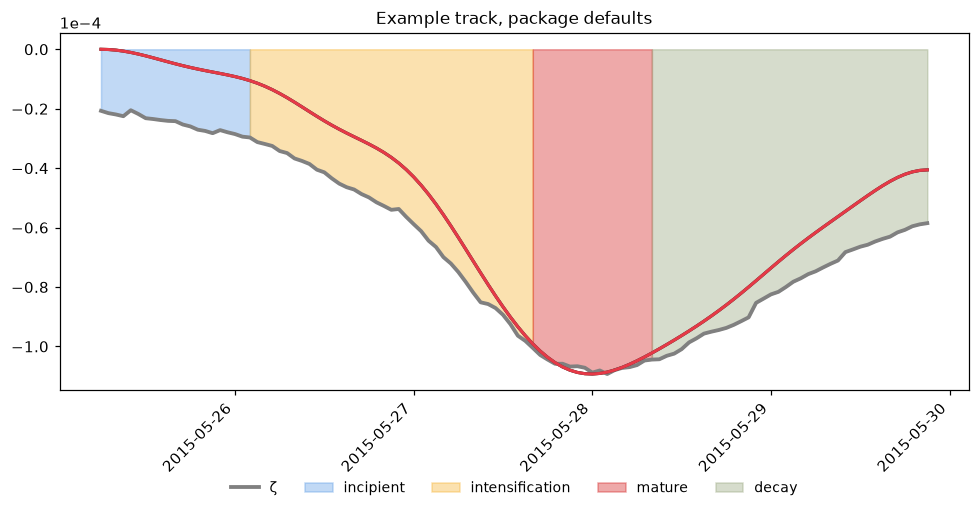
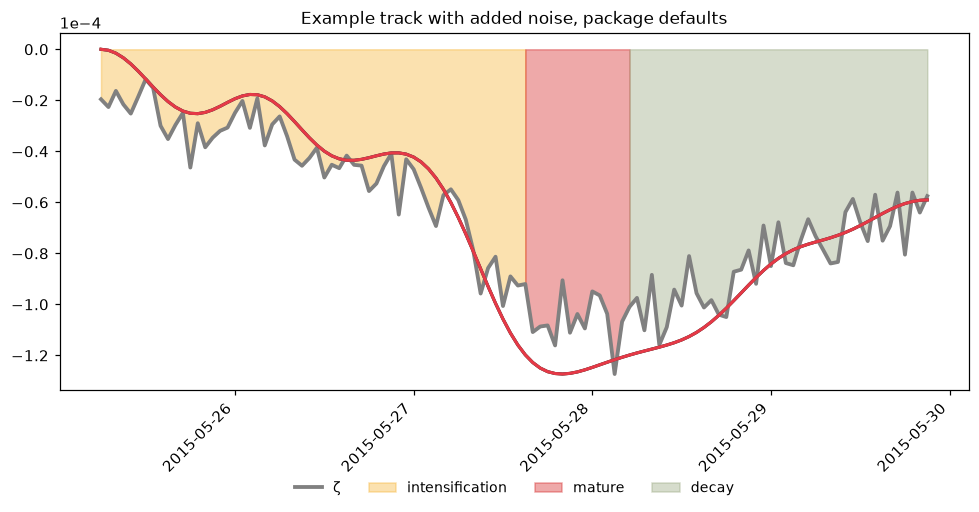
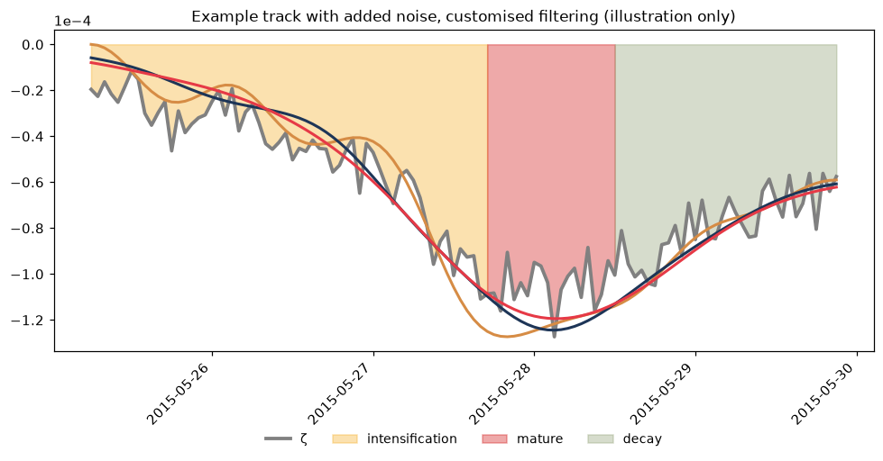

.. _usage:

Usage guide
===========

.. contents::
   :local:
   :depth: 1

Use the defaults
----------------

This is the preferred way to run CycloPhaser. The example below uses an hourly
track of one South-Atlantic extratropical cyclone from ERA5,
:repo:`docs/data/example_track_hourly.csv` (origin in
:repo:`docs/data/README.md`). It is a semicolon-separated file whose first lines
are:

.. literalinclude:: data/example_track_hourly.csv
   :lines: 1-3

The column ``min_max_zeta_850`` is the 850 hPa relative vorticity at the
cyclone's centre. Pass that column, indexed by time, to ``determine_periods``:

.. code-block:: python

   import pandas as pd
   from cyclophaser import determine_periods

   track = pd.read_csv("example_track_hourly.csv", parse_dates=[0], delimiter=";", index_col=[0])
   series = track["min_max_zeta_850"]

   result = determine_periods(series)

.. important::

   **The defaults assume one value per hour.** The filtering parameters are
   counted in time steps, and their defaults were set for hourly series. For a
   series with another time step, convert the parameters that are counted in
   time steps (listed in :doc:`defaults`, "Other inputs") before using them.

``result`` is a ``pandas.DataFrame`` indexed by time. Its ``periods`` column
holds the phase of every time step. The other columns hold the series the phases
were read from (see :doc:`overview`).

To also save a figure and a table of the phases, pass a file name (without
extension) to ``plot`` and ``export_dict``:

.. code-block:: python

   result = determine_periods(series, plot="example", export_dict="example")

This writes ``example.png`` and ``example.csv``. For the example track, with the
defaults:

   The hourly example track and the phases detected with the defaults. Grey:
   the raw vorticity; red: the series the phases were read from.

.. csv-table:: ``example.csv``: one row per phase, with its first and last time step. A phase that occurs more than once gets a number (``decay 2``).
   :file: generated/example_default_phases.csv
   :header-rows: 1

If ``series`` is a list or a NumPy array, also pass the times as ``x``. For
Northern-Hemisphere vorticity (cyclones are positive), pass
``hemisphere="northern"``: the series is multiplied by -1 before the detection.

.. warning::

   **What the filtering was validated for.** The default filtering was tested
   and validated only for series that already come from a tracking algorithm
   that applies filtering. Other inputs (other levels or variables, other time
   steps, series that were not filtered by the tracking) may need a different
   filtering. See :doc:`defaults`.

Customise the filtering
-----------------------

Before detecting phases, ``determine_periods`` filters the series (the
``process_vorticity`` step, see :doc:`overview`). These arguments control it:

* ``use_filter``: the Lanczos band-pass filter; ``'auto'``, a window length in
  time steps, or ``False`` to switch it off;
* ``cutoff_low`` and ``cutoff_high``: the longest and the shortest periods the
  filter keeps, in time steps;
* ``boundary_padding``: how the series is extended beyond its ends before
  filtering (``"reflect"``, ``"edge"`` or ``"zero"``);
* ``use_smoothing`` and ``use_smoothing_twice``: Savitzky-Golay smoothing after
  the filter, once or twice; ``'auto'``, a window length in time steps, or
  ``False``;
* ``savgol_polynomial``: the polynomial order of that smoothing.

Their defaults are listed in :doc:`defaults`, and every argument is described
in the :doc:`api`.

As an illustration, the example track with added noise, first with the defaults
and then with the smoothing switched on (``noisy_series`` is the example
series plus noise):

.. code-block:: python

   result_default = determine_periods(noisy_series)
   result_custom = determine_periods(noisy_series, use_smoothing="auto", use_smoothing_twice="auto")

   The example track with added noise, detected with the defaults.

   The same noisy track with ``use_smoothing="auto"`` and
   ``use_smoothing_twice="auto"``. Orange: the filtered series; dark blue:
   after one smoothing pass; red: after two, the series the phases are read
   from. **This only illustrates how to
   customise the filtering. It is not a validated configuration.**

The noise and both figures are made by ``docs/figures/make_noisy_example.py``
in the repository.

Other options
-------------

``determine_periods`` also takes the parameters of the phase detection: the
duration thresholds, the method for the mature and the incipient phases, the
depth floors, the prominence filter on the extrema, and others. They are
described in the :doc:`api` and listed with their defaults in :doc:`defaults`.

.. warning::

   The phase-detection defaults were calibrated against manually labelled
   cyclones. Changing them can produce spurious detections: phases that start or
   end in the wrong place, or that should not be there at all. Inspect the
   result whenever you change them.

``determine_periods`` runs two steps, ``process_vorticity`` (filtering) and
``get_periods`` (phase detection). To run them separately, for example to look
at the filtered series before detecting phases, call them in that order (see
:doc:`overview`).
