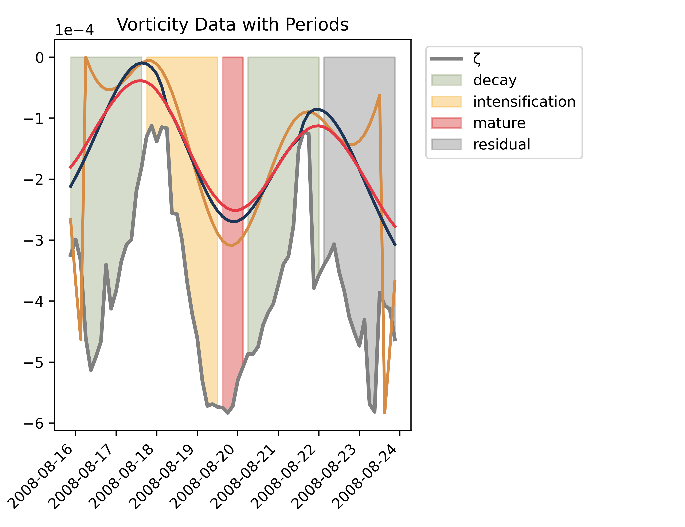

.. _usage:

Usage Guide
===========

.. contents::
   :local:
   :depth: 2

Introduction
------------

The example provided in this guide demonstrates how to use the CycloPhaser package to analyze the life cycle phases of an extratropical cyclone. The data used in this example corresponds to the track file of a specific extratropical cyclone whose genesis occurred near the eastern coast of Argentina. This track file was produced using the LorenzCycleToolkit (https://github.com/daniloceano/LorenzCycleToolkit). The file contains the cyclone's position, as well as information regarding the minimum relative vorticity, geopotential height, and maximum wind speeds within a defined domain centered on the cyclone. CycloPhaser helps in dissecting this cyclone into distinct life cycle phases using the minimum vorticity time series.

Arguments and Parameters for determine_periods
----------------------------------------------

- **series**: (list) A list of vorticity values to be analyzed. **Note:** The series does not need to be in any specific units. The algorithm is designed to work with vorticity data, but other meteorological fields like sea level pressure (SLP) or geopotential height. However, these have not been fully tested yet, so care is advised when interpreting results from fields other than vorticity.
- **x**: (list, optional) Temporal range or labels corresponding to the series. This list must be the same length as the vorticity `series`. Default is None.
- **plot**: (str or bool, optional) Path for saving generated plots. Set to `False` to disable plotting. Default is False.
- **plot_steps**: (str or bool, optional) Path for saving step-by-step didactic plots. Set to `False` to disable step-wise plotting. Default is False.
- **export_dict**: (str or bool, optional) Path for exporting the detected periods as a CSV file. Set to `False` to skip exporting. Default is False.
- **use_filter**: (str or bool, optional) Whether to apply a Lanczos filter to the vorticity data. Specify a window length as an integer, or set to 'auto' to automatically adapt based on the data. Default is 'auto'.
- **replace_endpoints_with_lowpass**: (int, optional) Replace the endpoints of the series with a lowpass filter. Specify the window length. Default is 24.
- **use_smoothing**: (str or bool, optional) Apply Savgol smoothing to the vorticity data. Specify the window length, or use 'auto' to adapt based on data length. Default is 'auto'.
- **use_smoothing_twice**: (str or bool, optional) Apply Savgol smoothing twice for additional noise reduction. Same options as `use_smoothing`. Default is 'auto'.
- **savgol_polynomial**: (int, optional) Polynomial order for Savgol smoothing. Default is 3.
- **cutoff_low**: (float, optional) Low-frequency cutoff for the Lanczos filter. Default is 168.
- **cutoff_high**: (float, optional) High-frequency cutoff for the Lanczos filter. Default is 48.

Example Usage
-------------

Below is an example of using the CycloPhaser package with default options. The function will generate plots and a CSV file that contains detected cyclone life cycle phases.

.. code-block:: python

   from cyclophaser import determine_periods, example_file
   import pandas as pd

   # Load test data
   track = pd.read_csv(example_file, parse_dates=[0], delimiter=';', index_col=[0])
   series = track['min_max_zeta_850'].tolist()
   x = track.index.tolist()

   # Example options for using CycloPhaser with default settings
   result = determine_periods(series, x=x, plot="test_default", plot_steps="test_steps_default", export_dict="test_default")

Output Examples
---------------

1. **Vorticity Data with Detected Periods**:

   This plot shows the vorticity data with key cyclone life cycle phases, such as intensification, decay, mature, and residual stages.

2. **Step-by-Step Didactic Plot**:

.. figure:: _images/test_steps_default.png
   :alt: Step-by-Step Didactic Plot

   The step-by-step plot provides a detailed breakdown of how the vorticity data is processed and how each cyclone phase is detected. This plot illustrates the filtering, smoothing, and phase detection processes.

3. **CSV Output**:

   The results of the detected cyclone life cycle phases are also exported as a CSV file, allowing for further analysis. Below is a preview of the CSV content:

.. code-block::

   phase,start,end
   intensification,2008-08-17,2008-08-19
   mature,2008-08-19,2008-08-20
   decay,2008-08-20,2008-08-22
   residual,2008-08-22,2008-08-24

This example showcases how users can utilize the CycloPhaser package to automatically detect and visualize extratropical cyclone life cycle phases from vorticity data.

Customizing Filtering
---------------------

In the previous example, the phase positioning might not match expectations for all datasets. To improve results, you can easily customize the filtering parameters:

.. code-block:: python

    from cyclophaser import determine_periods

    # Example options for custom filtering
    process_vorticity_args = {
        'cutoff_low': 100,
        'cutoff_high': 20,
        'use_filter': True,
        'use_smoothing': 10,
        'use_smoothing_twice': False,
    }

    # Example usage with custom parameters
    result = determine_periods(series, x=x, plot='test_custom', **process_vorticity_args)

.. figure:: _images/test_custom.png
    :alt: Vorticity Data with Detected Periods and Custom Parameters

    Cyclone phases positioning corrected using default parameters.

Important Notes
---------------

- **Hemisphere Support**: The tool is primarily set up for vorticity data from the southern hemisphere (negative vorticity). However, it can be used for the northern hemisphere by multiplying the vorticity data by -1.
- **Customization**: Most parameters, including filtering options and threshold values, can be customized to fit your dataset.