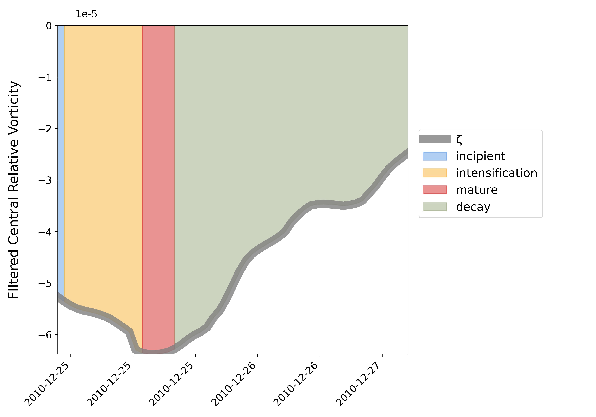

# Summary

CycloPhaser is a Python package designed to detect and analyze extratropical cyclone life cycles from central relative vorticity data. It enables researchers in meteorology and atmospheric sciences to automatically identify key stages of cyclone development, such as intensification, decay, and mature phases, using the vorticity series and its derivatives. By leveraging vorticity data, CycloPhaser helps scientists study cyclones across various regions and timeframes, contributing to improved understanding of cyclone energetics and behavior.

# Statement of Need

Extratropical cyclones are key features of the climate system. In South America, they are especially important due to the presence of cyclogenesis hotspots in southeast Brazil (SE-BR), the La Plata River basin (LA-PLATA), and southeastern Argentina (ARG) [@gramcianinov2019properties]. These cyclones can cause extreme precipitation, intense winds, high sea waves, and landslides, significantly impacting communities [@de2021ocean; @cardoso2022synoptic; @gramcianinov2023impact; @de2024extreme]. Understanding their temporal and spatial development and evolution is crucial for improving forecasts, ultimately aiding in the adoption of mitigation and adaptation strategies.

Accurately identifying the regions where cyclones are positioned throughout their distinct life cycle stages remains a significant challenge in atmospheric sciences. Seminal works by @bjerknes1922life, @shapiro1990fronts, @neiman1993life described extratropical cyclone life cycles in terms of structural changes and large-scale dynamics. However, these classifications were based on manual analysis of satellite imagery and synoptic charts, limiting their applicability to large datasets with multiple cyclone cases. Recent research has sought to objectively define cyclone life cycle stages using techniques such as normalizing the life cycle duration [@schemm2018during; @rudeva2007climatology] or bisecting the cycle into "intensification" and "decay" phases by focusing on periods before and after peak vorticity or the lowest central pressure [@dacre2009spatial; @trigo2006climatology; @azad2014vorticity; @booth2018extratropical; @michaelis2017changes]. While these approaches support the study of cyclone intensification and decay, they tend to overlook critical phases such as the incipient stage — where environmental dynamics are still adapting to the developing low-level disturbance and surface isobars are not yet fully closed. Additionally, they treat the mature phase as a single time step, failing to account for the possibility that it may encompass multiple time steps during which the cyclone exhibits homogeneous features.

The pioneering work by @couto2024new was the first to offer a comprehensive analysis of extratropical cyclone life cycles, dissecting systems into distinct life cycle phases and enabling the detection of multiple configurations across different systems. This study presents the Python package that facilitated such work. The method allows for an automated classification of cyclone life cycle stages, enabling the efficient processing of large datasets with minimal computational cost. This tool opens new avenues for research, such as analyzing cyclone life cycle behavior in climate change projections, enabling comparisons with present-day climates, and providing insights into how cyclone life cycles may evolve in response to climate variability. Additionally, it offers potential for assisting model validation by comparing the spatial positioning of life cycle phases across different models and reanalysis datasets. The package is both flexible and fully customizable, making it adaptable to a wide range of datasets and research needs.

# Features

CycloPhaser requires a time series of relative vorticity data as its primary input. The input data should represent the minimum central relative vorticity of extratropical cyclones, ideally at a specified pressure level (e.g., 850 hPa). This vorticity series, which is typically derived from atmospheric reanalysis datasets, serves as a proxy for cyclone intensity. The series must be provided as a one-dimensional list or array of vorticity values, which will be analyzed to detect key life cycle stages of the cyclone. Additional optional input includes a time or label series for the corresponding vorticity values. Users should ensure the time series corresponds to regular time steps (e.g., hourly or 6-hourly data).

The program includes optional pre-processing steps, such as applying a Lanczos filter to remove noise from the series and a Savitzky-Golay filter for smoothing, ensuring sinusoidal patterns in the data for phase detection. Key cyclone phases — intensification, decay, and mature — are identified through peaks and valleys in the vorticity time series. The intensification phase spans from a vorticity peak to the next valley, while the decay phase covers the opposite. The mature phase is defined as the period between a vorticity valley and neighboring derivative peaks. The pre-processing steps, as well as peaks and valleys detection in the vorticity series, are computed using Scipy's package [@virtanen2020scipy].

Thresholds for phase detection were rigorously calibrated in @couto2024new using a representative set of cyclone tracks, ensuring accurate phase identification while filtering out noise. CycloPhaser also includes a residual phase to account for tracking anomalies, such as post-decay re-intensification without returning to maturity. A post-processing step further refines the phase boundaries by correcting gaps and isolating single time-step phases. Finally, the incipient stage is detected by missing labels in the series or by selecting the initial time steps. More details are discussed in @couto2024new.

Although the package was initially devised for detecting life cycle phases using relative vorticity, it could potentially be applied to other time series used as proxies for cyclone detection, such as sea level pressure (SLP) or wind data. However, it has not yet been explicitly tested for these variables. Additionally, the program was designed for use in the Southern Hemisphere, but it can be applied to Northern Hemisphere vorticity series by multiplying the data by minus one, as the input data currently needs to be negative.

# References
